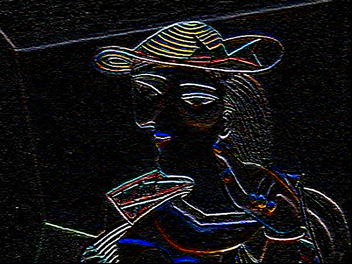

<h1> Convolutional layer in RGB image processing with C++ </h1>

## OOP Classes & Functions:
<ul>
  <li> <i>Point (int x, int y)</i> for the coordination system locates on the RGB image</li>
  <li> <i>PixelRGB (float red, float green, float blue) </i> for 3 foundation color value [0, 255]</li>
  <li> <i>ImageRGB (int width, int height) </i> with a pointer 'pixels' stores values of RGB pixels, located using Point</li>
  <li> <i>Kernel3x3 (string type) </i> is a class for convolutional filter with a name type = {'none', 'horizontal', 'vertical', 'blur} </li>
</ul>

Function Convolution(ImageRGB& img, Kernel3x3$ ker) to do the task of convolution with no-padding, unit-stride takes an input image (i.e picasso.bmp with the size of 450x600) and a kernel size 3x3

## Results
Original image

Horizontal and vertical edge detection using Sobel filter

   <i>Horizontal edge detection</i>

   <i>Vertical edge detection</i>
